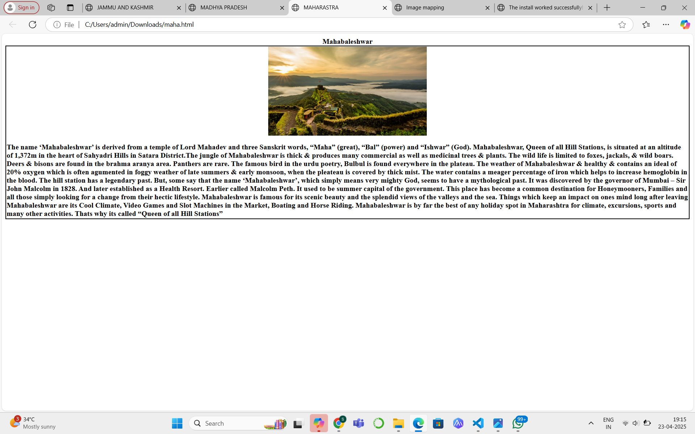

# Ex04 Places Around Me
## Date: 23.04.2025

## AIM
To develop a website to display details about the places around my house.

## DESIGN STEPS

### STEP 1
Create a Django admin interface.

### STEP 2
Download your city map from Google.

### STEP 3
Using ```<map>``` tag name the map.

### STEP 4
Create clickable regions in the image using ```<area>``` tag.

### STEP 5
Write HTML programs for all the regions identified.

### STEP 6
Execute the programs and publish them.

## CODE
```
map.html
<!DOCTYPE html>
<html>
    <head>
        <center>
        <title>Image mapping</title>
        </center>
    </head>
    <body>
        <center>
        
        </center>

        <map name="mapping">
            <area shape="circle" coords="25,122,48" title="Circle" href="file:///C:/Users/admin/Downloads/Untitled-2.html">
            <area shape="circle" coords="321,214,18" title="Circle" href="file:///C:/Users/admin/Downloads/Untitled-3.html">
            <area shape="circle" coords="427,350,12" title="Circle" href="file:///C:/Users/admin/Downloads/maha.html">
        </map>
    </body>
</html>

1
<html>
    <head>
        <title>UNIVERSITE</title>
    </head>
    <body>
         <center><b>SRINAGAR - tourist place</b></center>
            <table>
                <style>
                    table,th,td{border:2px solid black;
                   border-collapse:collapse;}
                   </style>
                   <tr>
                    <td>
                        <center>
                        
                        </center>
                        <p><b>Srinagar (/ˈsriːnəɡər/ ⓘ; Kashmiri: [siriːnagar]) is a city in Indian-administered Jammu and Kashmir in the disputed Kashmir region.[1] It is the largest city and summer capital of Jammu and Kashmir, which is an Indian-administered union territory. It lies in the Kashmir Valley along the banks of the Jhelum River, and the shores of Dal Lake and Anchar Lakes, between the Hari Parbat and Shankaracharya hills. The city is known for its natural environment, various gardens, waterfronts and houseboats. It is also known for traditional Kashmiri handicrafts like the Kashmir shawl (made of pashmina and cashmere wool), papier-mâché, wood carving, carpet weaving, and jewel making, as well as for dried fruits.[11][12] It is the second-largest metropolitan area in the Himalayas (after Kathmandu, the capital of Nepal).

                            Founded in the 6th century during the rule of the Gonanda dynasty according to the Rajatarangini, the city took on the name of an earlier capital thought to have been founded by the Mauryas in its vicinity. The city remained the most important capital of the Kashmir Valley under the Hindu dynasties, and was a major centre of learning. During the 14th–16th centuries the city's old town saw major expansions, particularly under the Shah Mir dynasty, whose kings used various parts of it as their capitals. It became the spiritual centre of Kashmir, and attracted several Sufi preachers. It also started to emerge as a hub of shawl weaving and other Kashmiri handicrafts. In the late 16th century, the city became part of the Mughal Empire, many of whose emperors used it as their summer resort. Many Mughal gardens were built in the city and around Dal lake during this time, of which Shalimar and Nishat are the most well-known.
                            
                            After passing through the hands of the Afghan Durranis and the Sikhs in the late 18th and early 19th century, it eventually became the summer capital of the Dogra kingdom of Jammu and Kashmir in 1846. The city became a popular tourist destination among Europeans and Indian elites during this time, with several hotels and its iconic houseboats being built. In 1952, the city became the summer capital of Jammu and Kashmir, a region administered by India as a state, with Jammu being its winter capital. It was the flashpoint of violence during the 1990s and early 2000s insurgency in the region. In 2019, it became the summer capital of a smaller region which is administered by India as a union territory, after the former state's reorganisation.
                            
                            Name.</p></b>
                    </td>

                   </tr>
            </table>
    </body>
</html>

2
<html>
    <head>
        <title>PARIS</title>
    </head>
    <body>
         <center><b>Temple-Khajuraho</b></center>
            <table>
                <style>
                    table,th,td{border:2px solid black;
                   border-collapse:collapse;}
                   </style>
                   <tr>
                    <td>
                        <center>
                        
                        </center>
                       <p><b>The Khajuraho Group of Monuments are a group of Hindu and Jain temples in Chhatarpur district, Madhya Pradesh, India. They are about 283 km (177mi) from Gwalior, 175 kilometres (109 mi) southeast of Jhansi, 10 kilometres (6.2 mi) from Khajwa and 9 kilometres (5.6 mi) from Rajnagar. The temples are famous for their Nagara-style architectural symbolism and a few erotic sculptures.[1]

                        Most Khajuraho temples were built between 885 CE and 1000 CE by the Chandela dynasty.[2][3] Historical records note that the Khajuraho temple site had 85 temples by the 12th century, spread over 20 square kilometres (7.7 sq mi). Of these, only about 25 temples have survived, spread over six square kilometres (2.3 sq mi).[3] Of the surviving temples, the Kandariya Mahadeva Temple is decorated with a profusion of sculptures with intricate details, symbolism, and expressiveness of ancient Indian art.[4] The temple complex was forgotten and overgrown by the jungle until 1838 when Captain T.S. Burt, a British engineer, visited the complex and reported his findings in the Journal of the Asiatic Society of Bengal.[5]
                        
                        When these monuments were built, the boys in the place lived in hermitages, by being brahmacharyas (bachelors) until they attained manhood and these sculptures helped them to learn about the worldly role of 'householder'.[6] The Khajuraho group of temples were built together but were dedicated to two religions, Hinduism and Jainism, suggesting a tradition of acceptance and respect for diverse religious views among Hindus and Jains in the region.[7] Because of their outstanding architecture, diversity of temple forms, and testimony to the Chandela civilization, the monuments at Khajuraho were inscribed on the UNESCO World Heritage List in 1986.[8][3</b></p>
                    </td>

                   </tr>
            </table>
    </body>
</html>

3
<html>
    <head>
        <title>AUSTERILLZ</title>
    </head>
    <body>
         <center><b>Mahabaleshwar</b></center>
            <table>
                <style>
                    table,th,td{border:2px solid black;
                   border-collapse:collapse;}
                   </style>
                   <tr>
                    <td>
                        <center>
                        
                        </center>
                        <p><b>The name ‘Mahabaleshwar’ is derived from a temple of Lord Mahadev and three Sanskrit words, “Maha” (great), “Bal” (power) and “Ishwar” (God).

                            Mahabaleshwar, Queen of all Hill Stations, is situated at an altitude of 1,372m in the heart of Sahyadri Hills in Satara District.The jungle of Mahabaleshwar is thick & produces many commercial as well as medicinal trees & plants. The wild life is limited to foxes, jackals, & wild boars. Deers & bisons are found in the brahma aranya area. Panthers are rare. The famous bird in the urdu poetry, Bulbul is found everywhere in the plateau. The weather of Mahabaleshwar & healthy & contains an ideal of 20% oxygen which is often agumented in foggy weather of late summers & early monsoon, when the pleateau is covered by thick mist. The water contains a meager percentage of iron which helps to increase hemoglobin in the blood. The hill station has a legendary past. But, some say that the name ‘Mahabaleshwar’, which simply means very mighty God, seems to have a mythological past.
                            
                            It was discovered by the governor of Mumbai – Sir John Malcolm in 1828. And later established as a Health Resort. Earlier called Malcolm Peth. It used to be summer capital of the government. This place has become a common destination for Honeymooners, Families and all those simply looking for a change from their hectic lifestyle. Mahabaleshwar is famous for its scenic beauty and the splendid views of the valleys and the sea. Things which keep an impact on ones mind long after leaving Mahabaleshwar are its Cool Climate, Video Games and Slot Machines in the Market, Boating and Horse Riding. Mahabaleshwar is by far the best of any holiday spot in Maharashtra for climate, excursions, sports and many other activities. Thats why its called “Queen of all Hill Stations”
                            
                            </p></b>
                    </td>

                   </tr>
            </table>
    </body>
</html>
```

## OUTPUT





## RESULT
The program for implementing image maps using HTML is executed successfully.
